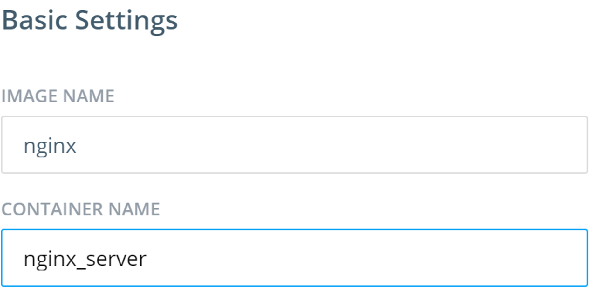
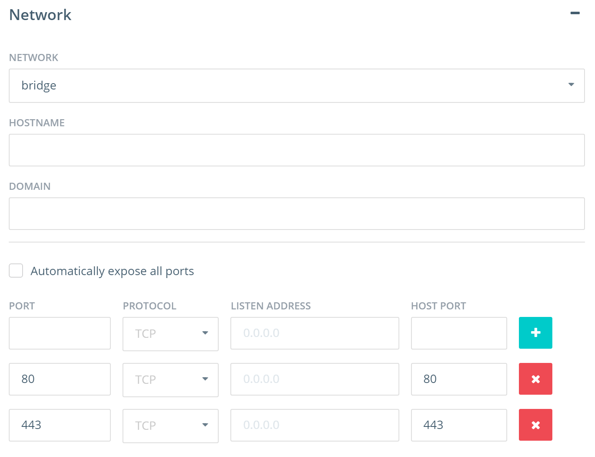
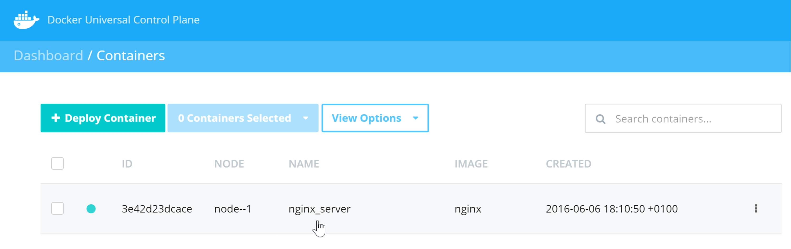
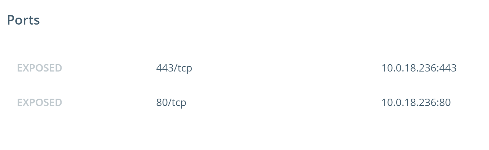
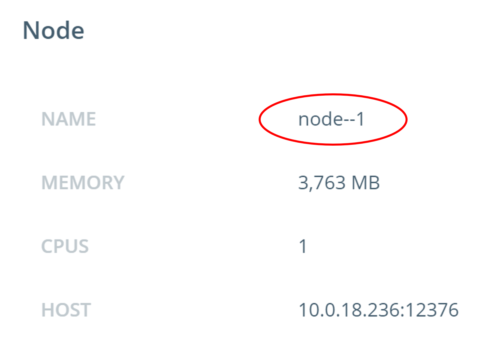
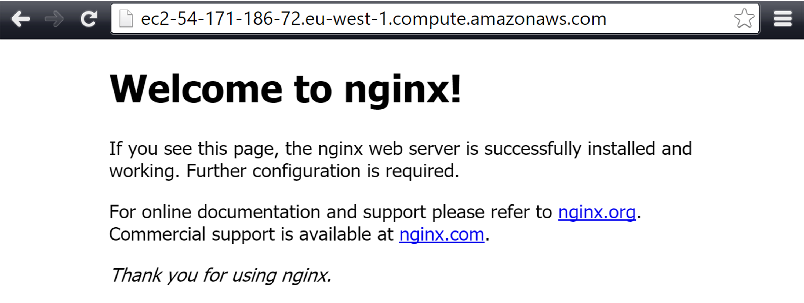

<!--
# Task 2: Deploy a container
//-->
# タスク 2: コンテナのデプロイ

<!--
In this task you will use USP to deploy a web server from the official NGINX image. The following steps will walk you through this process.
//-->
このタスクでは UCP を用いて、公式の NGINX イメージからウェブサーバをデプロイします。
次の手順通りに実施してください。

<!--
1. Deploy a container
2. Test the deployment
//-->
1. コンテナをデプロイする
2. デプロイをテストする

<!--
## Prerequisites
//-->
## 前提条件
<!--
- UCP setup with 3 nodes connected to the UCP controller
//-->

- UCP コントローラに 3つのノードを接続して UCP を設定済であること

<!--
## Step 1 - Deploy a container
//-->
## 手順 1 - コンテナのデプロイ
<!--
In this step you will launch a new container based on the NGINX image using the UCP web UI.
//-->
この手順では UCP の Web UI を用いて、NGINX イメージから新しいコンテナを起動します。

<!--
1. If you have not already done so, log in to UCP with the built-in **admin** account.

2. Click the **Containers** link on left navigation bar.

3. Click on **+ Deploy Container** button.

4. Fill out the Basic Settings as shown below:
//-->
1. まだ完了していなければ、組み込みアカウント **admin** で UCP にログインします。

2. 左にあるナビゲーションバーの **Containers** をクリックします。

3. **+ Deploy Container** ボタンをクリックします。

4. Basic Settings フォームを次のように埋めます:

<!--
  
//-->
  

<!--
5. Expand the **Network** section on the same page and configure the following port mappings:
//-->
5. 同じページの **Network** セクションを開き、次のようにポートマッピングを設定します:

<!--
  
//-->
  

<!--
6. Hit the **Run Container** button on the right side panel.
//-->
6. 右のサイドパネルの **Run Container** ボタンをクリックします。

<!--
  When the operation completes you will see your container listed as shown below. The green circle to the left of the container indicates that the container is in the **running** state.
//-->
  処理が完了すると、次のようにコンテナ一覧が表示されます。コンテナの左にある緑色の●印は、コンテナが **running** (実行中)の状態であることを示しています。

<!--
  
//-->
  

<!--
7. Click on the row where the container is listed to see the full container details. Then scroll down to the **Ports** section of the page to check the port mappings.
//-->
7. コンテナの詳細を見るには、一覧表示されているコンテナの行をクリックします。そして、ページの **Ports** セクションまでスクロールしていき、ポートマッピングを確認します。

<!--
  
//-->
  

<!--
## Step 2 - Quick Test
//-->
## 手順 2 - 簡単なテスト

<!--
In this step you will use your web browser to access the home page of the **nginx_server** container started in the previous step.
//-->
この手順では、先の手順で起動した **nginx_server** コンテナのホームページにアクセスするためにウェブブラウザを使います。

<!--
In order to access the NGINX container from your web browser you will need the DNS hostname of the node that the container is running on.
//-->
ウェブブラウザから NGINX コンテナにアクセスするには、コンテナが動作しているノードの DNS ホスト名が必要です。

<!--
1. First, let's take a look at the node our **nginx_server** container is running on. In the container details, you can find the node information.
//-->
まず、 **nginx_server** コンテナが動作しているノードを見てみましょう。コンテナの詳細は、ノード情報から見ることができます。

<!--
   
//-->
   

<!--
   In this particular example, the **nginx_server** container is running on the **node--1** node with an IP of 10.0.18.236. However, this is the private IP address of the node and you will not be able to use this address to connect to the web server. Locate the public IP, or public DNS name, of the node from the lab details you received (each lab machine you have will have a public and priave IP and DNS).
//-->
  この例では、 **nginx_server** コンテナは 10.0.18.236 の IP アドレスを持つ **node--1** ノード上で動作しています。しかし、これはノードのプライベート IP アドレスなので、このアドレスを使ってウェブサーバにアクセスすることはできません。提供されている環境の、ノードのパブリック IP アドレスかパブリック DNS 名を指定してください(各マシンはパブリック/プライベートの IP アドレスと DNS 名を持っています)。

<!--
2. Go to your web browser and enter the public IP or public DNS name of the node that the **nginx_server** container is running on.
//-->
2. **nginx_server** コンテナが動作しているノードのパブリック IP アドレスかパブリック DNS 名に、ウェブブラウザでアクセスしてください。

<!--
   You will see the NGINX welcome page.
//-->
   NGINX のウェルカムページが見えるはずです。

<!--
   
//-->
   

<!--
You have successfully launched a web container using the Docker UCP web UI.
//-->
Docker UCP web UI を使って、ウェブサーバコンテナの起動に成功しました。
