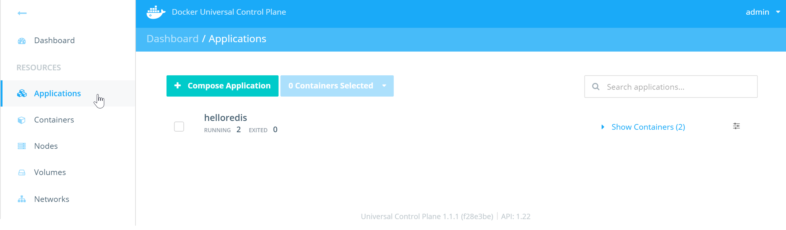
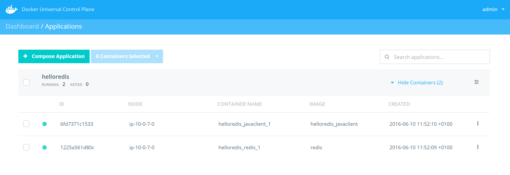
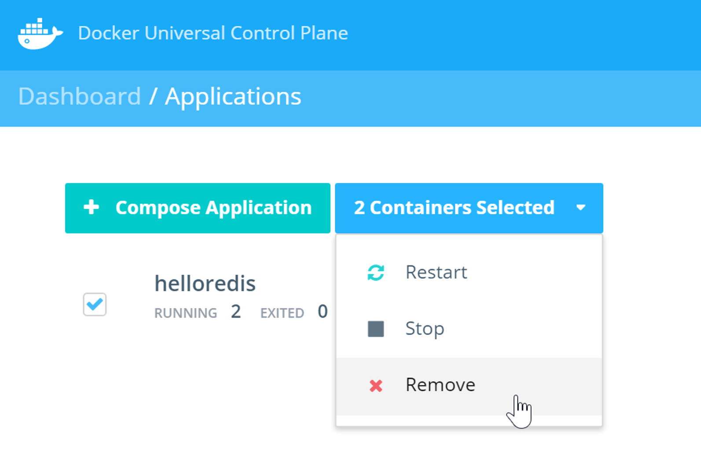
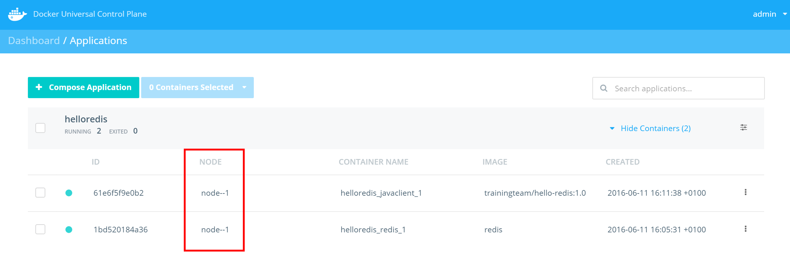

<!--
# Task 4 - Deploy a simple application on UCP
//-->
# タスク 4 - UCP に簡単なアプリケーションをデプロイする

<!--
> **Difficulty**: Beginner
//-->
> **難易度**: 初心者向け

<!--
> **Time**: Approximately 15 minutes
//-->
> **所要時間**: およそ 15 分

<!--
This task will walk you through the steps of deploying simple applications to Docker UCP. You will complete the following steps in this task.
//-->
このタスクでは Docker UCP に簡単なアプリケーションをデプロイする手順を行います。

<!--
- Use **Docker Compose** to deploy a web app
- Use the **Client Bundle** to deploy the app
- Deploy and connect to a web app
//-->
- **Docker Compose** を使ってウェブアプリをデプロイする
- **Client Bundle** を使ってアプリをデプロイする
- ウェブアプリをデプロイして接続する

<!--
## Pre-requisites
//-->
## 前提条件

<!--
- You must have [Docker Toolbox](https://www.docker.com/products/docker-toolbox) installed on your local machine
//-->

- [Docker Toolbox](https://www.docker.com/products/docker-toolbox) をローカルマシンにインストール済であること

<!--
## Step 1 - Deploy an application using Docker Compose
//-->
## 手順 1 - Docker Compose を使ってアプリケーションをデプロイ

<!--
In this step you will use **Docker Compose** to deploy a simple multi-container application. The application contains the following 2 services (containers).
//-->
この手順では **Docker Compose** を使って簡単な複数コンテナのアプリケーションをデプロイします。このアプリケーションは次の 2つのサービス(コンテナ)を含みます。

<!--
  - Redis
  - A Java client that pings the container to get a response
//-->

  - Redis
  - 応答を得るためにコンテナに ping する Java クライアント

<!--
1. SSH into your UCP controller as the built-in **ubuntu** user.
//-->
1. 組み込みの **ubuntu** ユーザで UCP コントローラに SSH ログインします。

<!--
  Your UCP controller is probably `node-0` in your lab.
//-->
  実践環境での UCP コントローラはおそらく `node-0` です。

<!--
2. Use `git` to clone the application repository from https://github.com/johnny-tu/HelloRedis.git
//-->
2. `git` コマンドを使って https://github.com/docker-training-ja/HelloRedis.git からアプリケーションのレポジトリを clone します。

   ```bash
   $ git clone https://github.com/docker-training-ja/HelloRedis.git
   Cloning into 'HelloRedis'...
   remote: Counting objects: 45, done.
   remote: Total 45 (delta 0), reused 0 (delta 0), pack-reused 45
   Unpacking objects: 100% (45/45), done.
   Checking connectivity... done.
   ```

<!--
   This will clone the repo into a new directory called `HelloRedis` within your home directory - `/home/ubuntu/HelloRedis`.
//-->
   これにより、ホームディレクトリ以下の `HelloRedis` という新しいディレクトリ( `/home/ubuntu/HelloRedis` )にレポジトリを clone します。

<!--
3. Change directory into `HelloRedis`
//-->
3. `HelloRedis` ディレクトリに移動します。

  ```bash
  $ cd HelloRedis
  ```

<!--
4. List the files in the directory.
//-->
4. ディレクトリ内のファイル一覧を表示します。

   ```bash
   $ ls
   docker-compose.prod.yml  docker-compose.yml  Dockerfile  lib  README.md  src
   ```

<!--
5. Use **Docker Compose** to bring up the application defined in the `docker-compose.yml` file. You must run the command from the `HelloRedis` directory.
//-->
5. **Docker Compose** を使い、 `docker-compose.yml` ファイルに定義したアプリケーションを起動します。コマンドは `HelloRedis` ディレクトリ内で実行しなければいけません。

   ```bash
   $ docker-compose up -d
   Pulling redis (redis:latest)...
   latest: Pulling from library/redis
   ...
   ...
   Digest: sha256:ddb31adb1f61405ee59fc9c569c2b09f1796d0f2190e78d84b873f2d930236c1
   Status: Downloaded newer image for redis:latest
   Creating helloredis_redis_1
   Building javaclient
   Step 1 : FROM java:7
    ---> 9f4357ff2eef
   Step 2 : COPY /src /HelloRedis/src
    ---> eabdb34fe077
   Removing intermediate container fd05659c730a
   Step 3 : COPY /lib /HelloRedis/lib
    ---> 16a65528b2ce
   Removing intermediate container 9f52240204e6
   Step 4 : WORKDIR /HelloRedis
    ---> Running in 686c4bd65d85
    ---> 01d9a0c2a101
   Removing intermediate container 686c4bd65d85
   Step 5 : RUN javac -cp lib/jedis-2.1.0-sources.jar -d . src/HelloRedis.java
    ---> Running in f829db30c628
    ---> 9f08dd8a743c
   Removing intermediate container f829db30c628
   Step 6 : CMD java HelloRedis
    ---> Running in 0e070b1cd994
    ---> 9dc249ef701d
   Removing intermediate container 0e070b1cd994
   Successfully built 9dc249ef701d
   Creating helloredis_javaclient_1

   ```

<!--
  This brings up the application defined in `docker-compose.yml`.
//-->
  これにより `docker-compose.yml` で定義したアプリケーションが起動します。

<!--
6. Run `docker-compose ps` to verify that the application started correctly and is still running.
//-->
6. アプリケーションが正しく起動し、動作中であるか検証するには `docker-compose ps` を実行します。

   ```bash
   $ docker-compose ps
            Name                        Command               State    Ports
   ---------------------------------------------------------------------------
   helloredis_javaclient_1   java HelloRedis                  Up
   helloredis_redis_1        docker-entrypoint.sh redis ...   Up      6379/tcp
   ```

<!--
  The output above shows that the Java client service and the Redis database service are both up and running.
//-->
  この出力は、Java クライアントサービスと Redis データベースサービスの両方が起動して動作中であることを示しています。

<!--
7. Open the UCP Web UI with your web browser.
//-->
7. UCP Web UI をブラウザで開きます。

<!--
8. Click the **Applications** link on the left navigation bar.
//-->
8. 左のナビゲーションバーの **Applications** をクリックします。

<!--
9. You will see the following output
//-->
9. 次のような画面になります。

<!--
     
//-->
   

<!--
10. Click the **Show Containers** link on the right side to view the Redis and Java client containers that make up the application.
//-->
10. 右側の **Show Containers** をクリックすると、アプリケーションを構成している Redis コンテナと Java クライアントコンテナが表示されます。

<!--
   
//-->
   


<!--
## Step 2 - Using the Client Bundle
//-->
## 手順 2 - Client Bundle の利用

<!--
Manually logging into (SSH) the UCP node to run `docker-compose` to deploy your applications is not always convenient, and in a lot of cases is not possible. This is where the **client bundle** helps out.
//-->
`docker-compose` を実行してアプリケーションをデプロイするために、UCP ノードに SSH で手動ログインするのは不便ですし、多くの場合でそれは不可能でしょう。そこで **client bundle** の出番です。

<!--
The **client bundle** sets up your local machine with the certificates and other settings needed for you to issue `docker` and `docker-compose` commands to UCP.
//-->
**client bundle** は、UCP に対して `docker` コマンドと `docker-compose` コマンドを実行するのに必要な証明書や設定をローカルマシンに設定します。

<!--
This step is broken up into the following two sub-steps:
//-->
次の 2つの手順を行います:

<!--
  - Configure your environment to use the Client Bundle
  - Deploy the app with the Client Bundle
//-->

  - Client Bundle を使うように環境設定する
  - Client Bundle を使ってアプリをデプロイする

<!--
### Step 2.1 - Configure your environment to use the Client Bundle
//-->
### 手順 2.1 - Client Bundle を使うように環境設定

<!--
1. Navigate to your user profile in UCP.
//-->
1. UCP のユーザプロファイルを表示します。

   

<!--
2. Click the **Create a Client Bundle** button. This will download a **zip** file with the necessary keys, certificates, and scripts needed to connect your Docker client to UCP.
//-->
2. **Create a Client Bundle** ボタンをクリックします。これにより、Docker クライアントが UCP に接続するために必要な鍵ファイル、証明書ファイル、スクリプトファイルをまとめた **zip** ファイルがダウンロードできます。

   

<!--
  Your browser may warn you about the download. Be sure to choose the option to keep the downloaded file.
//-->
  ブラウザはダウンロードについて警告を表示するかもしれません。問題なくファイルがダウンロードできるオプションを選択してください。

<!--
3. Unzip the **Client Bundle** to a folder of your choice and open a command prompt to that location.
//-->
3. 任意のディレクトリで **Client Bundle** を unzip し、コマンドプロンプトを開きます。

<!--
4. List the files in the folder that you have just unzipped the client bundle contents to.
//-->
4. unzip した client bundle のファイルを一覧表示します。

<!--
   In this example we are using a Windows machine and we have unzipped the bundle to `C:\Docker\ucp_client_bundles\ucp-bundle-admin`.
   Let's examine the directory using the Windows command prompt (CMD).
//-->
   この例では Windows マシンを使っていて、client bundle を `C:\Docker\ucp_client_bundles\ucp-bundle-admin` に unzip しました。
   Windows コマンドプロンプト (CMD) を使ってディレクトリ内を見てみましょう。

   ```
   C:\Docker\ucp_client_bundles\ucp-bundle-admin> dir
    Volume in drive C is OS
    Volume Serial Number is 10D0-EAA3

    Directory of C:\Docker\ucp_client_bundles\ucp-bundle-admin

   20/05/2016  04:54 PM    <DIR>          .
   20/05/2016  04:54 PM    <DIR>          ..
   20/05/2016  04:52 PM             3,684 ca.pem
   20/05/2016  04:52 PM             5,392 cert.pem
   20/05/2016  04:52 PM               450 cert.pub
   20/05/2016  04:52 PM               623 env.cmd
   20/05/2016  04:52 PM               662 env.ps1
   20/05/2016  04:52 PM               609 env.sh
   20/05/2016  05:23 PM    <DIR>          HelloRedis
   20/05/2016  04:52 PM             1,679 key.pem
               7 File(s)         13,099 bytes
               3 Dir(s)  595,220,852,736 bytes free

   ```

<!--
   As shown above, the directory contains the TLS keys and certificates, as well as a set of files named `env.cmd`, `env.ps1`, and `env.sh`. The `env.*` files are scripts that configure your current shell/environment so that it can send `docker` and `docker-compose` commands to your UCP controller.
//-->
   このように、ディレクトリ内には TLS 鍵ファイル、証明書ファイルと、 `env.cmd` 、 `env.ps1` 、 `env.sh` という名前のファイルがあります。この `env.*` ファイルは現在のシェルや環境を設定するためのスクリプトで、これで UCP コントローラに `docker` コマンドや `docker-compose` コマンドを使うことができます。

<!--
   Windows users can use the `env.cmd` or `env.ps1` scripts. OS X and Linux users can use the `env.sh` script.
//-->
   Windows ユーザは `env.cmd` スクリプトか `env.ps1` スクリプトを使います。OS X と Linux ユーザは `env.sh` スクリプトを使います。

<!--
   > **Note:** Windows users can opt to use a command line tool such as `git bash` and thus be able to follow the same instructions for Mac and Linux users.
//-->
   > **注意:** Windows ユーザは `git bash` のようなコマンドラインツールを使ってください。そうすると、Mac や Linux ユーザと同じ手順に従うことができます。

<!--
5. Inspect the contents of the `env.sh` file and take note of the environment variables it is setting.
//-->
5. `env.sh` ファイルの内容を確認します。特に、設定する環境変数に注目します。

   ```
   export DOCKER_TLS_VERIFY=1
   export DOCKER_CERT_PATH="$(pwd)"
   export DOCKER_HOST=tcp://ec2-54-187-21-127.us-west-2.compute.amazonaws.com:443
   ```

<!--
   The `DOCKER_TLS_VERIFY` variable turns on TLS verification between our Docker Client and the Docker Engine you want to communicate with (UCP controller).
//-->
   `DOCKER_TLS_VERIFY` の値は、Docker クライアントと通信先の Docker Engine (UCP コントローラ) 間の TLS 検証を有効にします。
<!--
   The `DOCKER_CERT_PATH` variable specifies where our TLS certificates and private key is located. In this case it is in the same folder as our `env.sh` script.
//-->
   `DOCKER_CERT_PATH` の値は、TLS 証明書と秘密鍵へのパスを指定します。この場合は `env.sh` スクリプトのあるディレクトリと同じです。
<!--
   The `DOCKER_HOST` variable specifies the address of the Docker Host you are connecting the client to. In this case your UCP controller node.
//-->
   `DOCKER_HOST` の値は、クライアントの通信先の Docker ホストのアドレスを指定します。この場合は UCP コントローラのノードです。

<!--
6. Execute the script that is appropriate to your Operating System:
//-->
6. お使いの OS に適したスクリプトを実行します。

  **Windows PowerShell**

  ```
  > . .\env.ps1
  ```

<!--
  Note the structure of the command above - the two dots. The first dot tells PowerShell to *dot-source* the script so that the environment variables it sets persist after the script finishes executing. The second dot combined with the backslash tell PowerShell to execute the script from the current directory. There is a space between the two dots but not between the second dot and the backslash :-D
//-->
  このコマンドの書式に注意してください。ドットが 2つあります。1つ目のドットは PowerShell に *dot-source* スクリプトであることを指示します。それにより、スクリプトの実行が完了した後も設定した環境変数が持続します。2つ目のドットとバックスラッシュの組み合わせは、カレントディレクトリでスクリプトを実行することを PowerShell に指示します。2つのドットの間にはスペースがあります。一方、2つ目のドットとバックスラッシュの間にはありません :-D

<!--
  If your system does not allow the execution of PowerShell scripts you may need to use the `Set-ExecutionPolicy Unrestricted` PowerShell cmdlet to enable script execution. You may have to run this from a PowerShell terminal opened with the `Run as Administrator` option. You may still be prompted to allow this script to execute. If you had to change your execution policy, you may wish to change it back to restricted after executing the script (`Set-ExecutionPolicy Restricted`).
//-->
  システムが PowerShell スクリプトの実行を許可していない場合、スクリプトの実行を許可する `Set-ExecutionPolicy Unrestricted` PowerShell コマンドレットを使う必要があります。 `Run as Administrator` オプションつきで PowerShell ターミナルを開いて実行しなければいけません。スクリプトの実行が許可されるでしょう。実行ポリシーを変更しなければいけなかった場合、(`Set-ExecutionPolicy Restricted`) スクリプトを実行すると制限状態に戻すことができます。

<!--
  **Windows command prompt**
//-->
  **Windows コマンドプロンプト**

  ```
  > env.cmd
  ```

<!--
  **Mac OS X and Linux**
//-->
  **Mac OS X と Linux**

  ```
  $ source ./env.sh
  ```

<!--
   To verify that that the script worked, check the value of the variables.
//-->
   スクリプトが動作したか確認するには、変数の値を確認します。

  **Windows PowerShell**

  ```
  > GetChildItem Env:
  ```

<!--
  The Docker related variables will be listed towards the top.
//-->
  Docker に関連する変数は上のほうに表示されます。

<!--
  **Windows command prompt**
//-->
  **Windows コマンドプロンプト**

  ```
  > set
  ```

<!--
  The Docker related variables will be listed towards the top.
//-->
  Docker に関連する変数は上のほうに表示されます。

<!--
  **Mac OS X and Linux**
//-->
  **Mac OS X と Linux**

   ```
   $ env | grep DOCKER
   ```

<!--
7. Now run `docker info` to verify that your local environment has been configured correctly. You should see the UCP controller and nodes listed as shown below.
//-->
7. ローカル環境が正しく設定されているか確認するために `docker info` を実行します。UCP コントローラとノードが次のように表示されます。

   ```
   C:\Docker\ucp_client_bundles\ucp-bundle-admin>docker info
   Containers: 17
    Running: 17
    Paused: 0
    Stopped: 0
   Images: 41
   Server Version: swarm/1.1.3
   Role: primary
   Strategy: spread
   Filters: health, port, dependency, affinity, constraint
   Nodes: 3
    ucp-controller: 10.0.15.6:12376
      Status: Healthy
      Containers: 12
      Reserved CPUs: 0 / 1
      Reserved Memory: 0 B / 3.859 GiB
      Labels: executiondriver=, kernelversion=4.2.0-23-generic, operatingsystem=Ubuntu 14.04.4 LTS, storagedriver=aufs
      Error: (none)
      UpdatedAt: 2016-05-24T05:04:06Z
    ucp-node-0: 10.0.7.110:12376
      Status: Healthy
      Containers: 2
      Reserved CPUs: 0 / 1
      Reserved Memory: 0 B / 3.859 GiB
      Labels: executiondriver=, kernelversion=4.2.0-23-generic, operatingsystem=Ubuntu 14.04.4 LTS, storagedriver=aufs
      Error: (none)
      UpdatedAt: 2016-05-24T05:04:20Z
    ucp-node-1: 10.0.28.145:12376
      Status: Healthy
      Containers: 3
      Reserved CPUs: 0 / 1
      Reserved Memory: 0 B / 3.859 GiB
      Labels: executiondriver=, kernelversion=4.2.0-23-generic, operatingsystem=Ubuntu 14.04.4 LTS, storagedriver=aufs
      Error: (none)
      UpdatedAt: 2016-05-24T05:04:23Z
   Cluster Managers: 1
    10.0.15.6: Healthy
      Orca Controller: https://10.0.15.6:443
      Swarm Manager: tcp://10.0.15.6:2376
      KV: etcd://10.0.15.6:12379
   Plugins:
    Volume:
    Network:
   Kernel Version: 4.2.0-23-generic
   Operating System: linux
   Architecture: amd64
   CPUs: 3
   Total Memory: 11.58 GiB
   Name: ucp-controller-ucp-controller
   ID: 44WM:6P6I:N6WZ:U4OB:RFMN:WKY7:OX3N:3OSU:GTE3:3SDC:FROD:OQ6Z
   Labels:
    com.docker.ucp.license_key=4dd1umru9iT8lplNkXi5I1cdZrdxBIl60qyNzB9i6x_b
    com.docker.ucp.license_max_engines=10
    com.docker.ucp.license_expires=2016-05-31 21:53:37 +0000 UTC
   ```

<!--
### Step 2.2 - Deploy the app with the Client Bundle
//-->
### 手順 2.2 - Client Bundle を使ってアプリをデプロイ

<!--
8. Clone the **HelloRedis** repository into another folder of your choice
//-->
8. 任意の他のディレクトリに **HelloRedis** レポジトリを clone します。

  ```
  > git clone https://github.com/docker-training-ja/HelloRedis.git
  ```

<!--
9. Remove the existing HelloRedis application from UCP.
//-->
9. UCP から既存の HelloRedis アプリケーションを削除します。

<!--
   
//-->
   

<!--
10. Launch the application by using the Client Bundle.
//-->
10. Client Bundle を使ってアプリケーションを起動します。

<!--
   To do this, change directory into the folder that you cloned the `HelloRedis` repo into and run `docker-compose up -d`
//-->
   `HelloRedis` レポを clone したディレクトリに移動して `docker-compose up -d` を実行します。

<!--
   You may notice the following error
//-->
   次のようなエラーになるはずです。

   ```
   > docker-compose up -d
   helloredis_redis_1 is up-to-date
   Creating helloredis_javaclient_1
   unable to find a node that satisfies image==helloredis_javaclient
   ....
   ```

<!--
   If you look inside the `docker-compose.yml` file, you will see that the `javaclient` service is defined with a `build` instruction. This is not advised on productions runs, especially when Docker Compose is interacting with Swarm or UCP. This is because Compose does not have the ability to build an image across every node in the cluster - Ii will build on the node the container is scheduled on. This can sometimes lead to errors if Swarm tries to schedule a container on a node without the image.
//-->
   `docker-compose.yml` ファイルを見てみると、 `build` に `javaclient` サービスを定義していることがわかるでしょう。これは本番環境における注意ではなく、特に Docker Compose が Swarm や UCP と通信する際の問題です。Compose はクラスタのすべてのノードにわたってイメージをビルドする機能を持っていないのです。つまり、コンテナがスケジュールされたノードでビルドを行います。そのため、Swarm がイメージを持たないノード上にコンテナをスケジュールしようと試みた場合にエラーを引き起こすことがあります。

<!--
   Best practice for production deployments is to only use pre-built images that are available through Registries such as Docker Hub and Docker Trusted Registry.
//-->
   本番環境でのデプロイにおけるベストプラクティスは、Docker Hub や Docker Trusted Registry のようなレジストリを通してビルド済みのイメージのみを使うようにすることです。

<!--
11. Inspect the contents of the `docker-compose.prod.yml` with your favorite text editor. Be sure to open the file with **prod** in the name.
//-->
11. お好みのテキストエディタで `docker-compose.prod.yml` の内容を確認します。ファイル名に **prod** とあるファイルを開くことに注意してください。

  ```
  javaclient:
    image: dockertrainingja/hello-redis:20160712
    links:
      - redis:redisdb
  redis:
    image: redis:3.2
  ```

<!--
  Notice that there are no `build` instructions in this file. All images referenced are pre-built images that are on Docker Hub - `trainingteam/hello-redis:1.0` and `redis`.
//-->
  このファイルには `build` がないことに注目してください。Docker Hub 上の `dockertrainingja/hello-redis:20160712` と `redis:3.2` という、ビルド済みイメージを使う形になっています。

<!--
12. Start the production version of the application with the following command (be sure to use the compose file with **prod** in its name).
//-->
12. 次のコマンドでアプリケーションの本番バージョンを起動します(ファイル名に **prod** を含んだ compose ファイルを使うことに注意してください)。

  ```
  > docker-compose -f docker-compose.prod.yml up -d
  ```

<!--
   The `-f` option lets you tell Docker Compose to use a specific file instead of the default `docker-compose.yml`.
//-->
   `-f` オプションは、Docker Compose にデフォルトの `docker-compose.yml` の代わりにファイルを使わせる際に使います。

<!--
13. Switch to the Docker UCP web UI and click the **Applications** link in the left hand bar.
//-->
13. Docker UCP web UI を開き、左のバーにある **Applications** をクリックします。

<!--
   Notice that both containers in the app are running on the same UCP node.
//-->
   アプリケーションの両方のコンテナは同じ UCP ノードで実行していることに注意してください。

<!--
   
//-->
   

<!--
   This is because the HelloRedis application uses a Compose v1 file as well as container *links*. When you have container links defined,
//-->
   これは HelloRedis アプリケーションは Compose v1 ファイルのコンテナ *links* を使っているためです。コンテナリンクが定義されています。
<!--
   Compose will run all linked containers on the same node. However, links are no longer the recommended method for connecting containers. The preferred method is *container networking*, which is supported in v2 Compose files.
//-->
   Compose はリンクしたすべてのコンテナを同じノードに起動します。しかし、links はコンテナを接続する方法としてもはや推奨されていません。推奨の方法は v2 Compose ファイルがサポートする *container networking* です。

<!--
You now know how to deploy Docker Compose applications from your local machine using **Client Bundles**.
//-->
これで **Client Bundles** を使ってローカルマシンから Docker Compose アプリケーションをどのようにデプロイするか理解できたと思います。
 
<!--
## Step 3 - Deploy another application   
//-->
## 手順 3 - 他のアプリケーションをデプロイ

<!--
For the following section, use what you have learnt just now and complete the steps listed below.
//-->
それでは、たった今学んだ知識を使って、次の手順を実行してみましょう。
   
<!--
1. Now that you’ve deployed your first application, it’s time to try another example. Go to https://github.com/prakhar1989/FoodTrucks
2. Clone the `FoodTrucks` repo into your local PC or Mac
3. Deploy the `FoodTrucks` application into UCP. Remember to use the Client Bundle
4. View the application in your web browser
//-->
1. 初めてのアプリケーションのデプロイは済んでいますね。他の例を試してみましょう。こちらです: https://github.com/docker-training-ja/FoodTrucks
2. `FoodTrucks` レポをローカルに clone します。
3. `FoodTrucks` アプリケーションを UCP にデプロイします。Client Bundle を使うのを忘れないでください。
4. ブラウザでアプリケーションを見てください。

<!--
   If you completed all the steps correctly, you should see a very cool application that allows you to search for food trucks in San Francisco
//-->
   すべての手順を正しく完了できたら、サンフランシスコの移動販売車を検索できるとてもクールなアプリケーションが見えるはずです。
   
   
   


   

