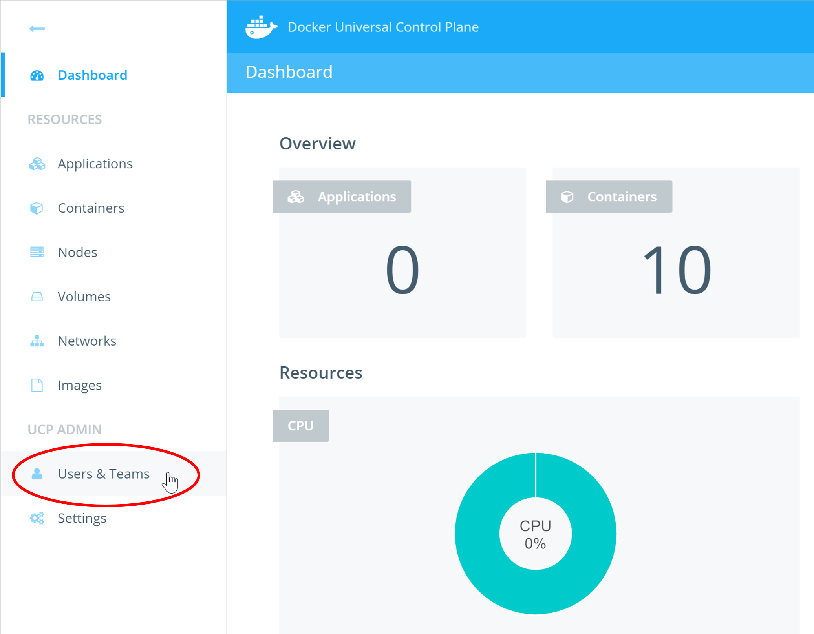
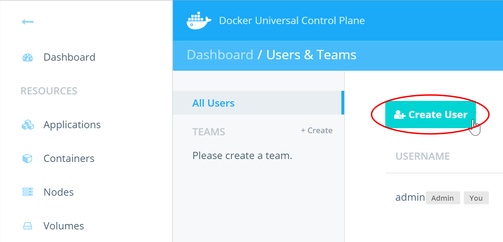
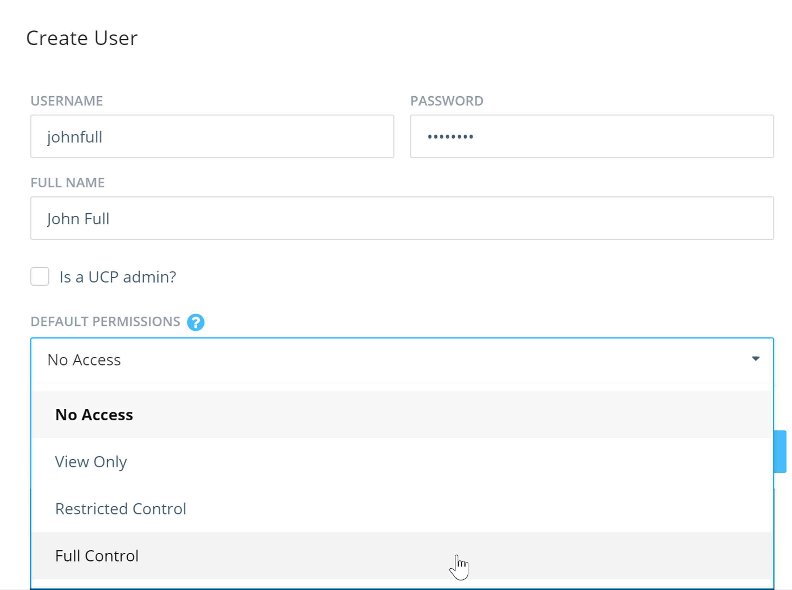
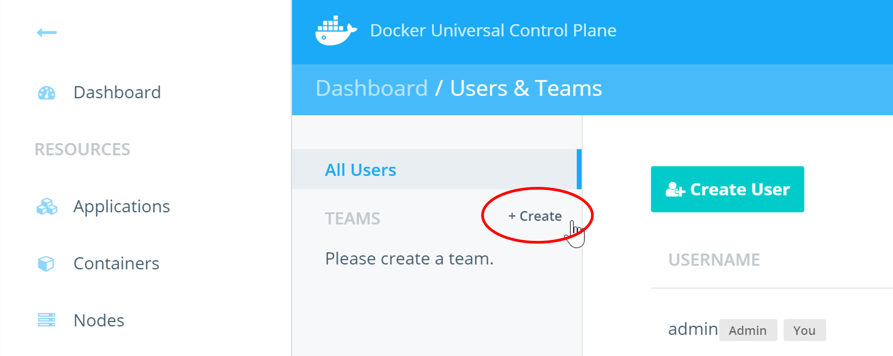
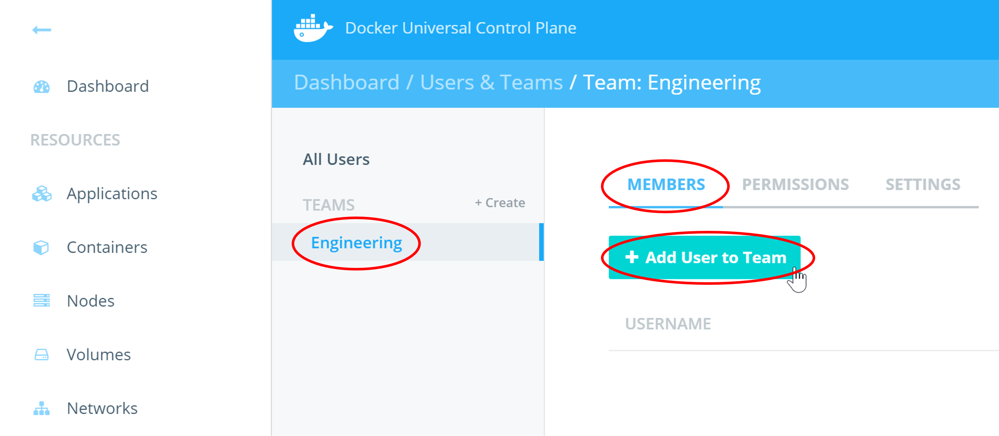
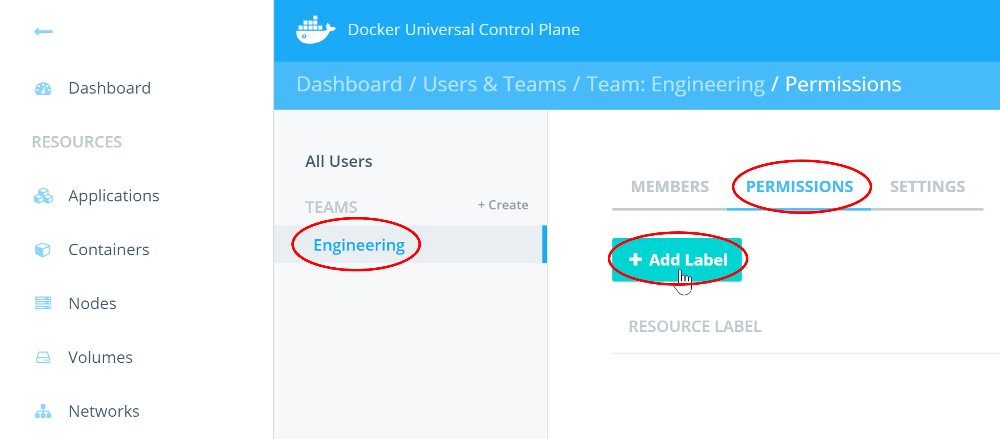
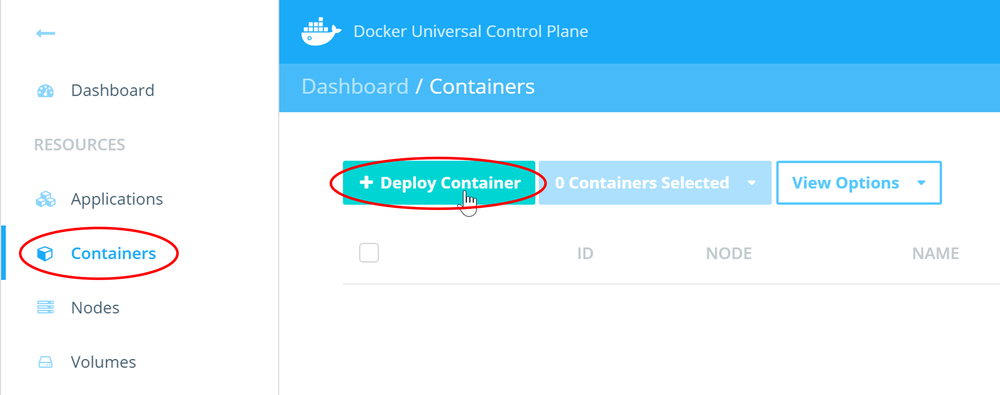
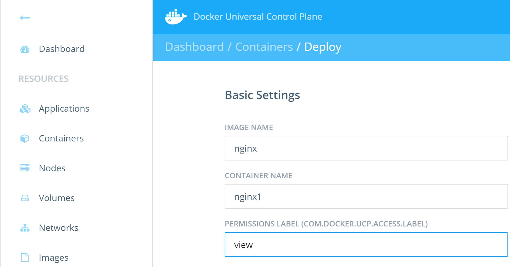

<!--
# Task 1 - Create Users and Teams
//-->
# タスク 1 - ユーザとチームの作成

<!--
In this task you will complete the following four steps.
//-->
このタスクでは次の手順を行います。

<!--
1. Create new users
2. Create a team and add users
3. Assign permissions to team
4. Deploy containers
//-->
1. 新しいユーザの作成
2. チームを作成し、ユーザを追加
3. チームにパーミッションを割り当て
4. コンテナをデプロイ

<!--
## Pre-requisites
//-->
## 前提条件

<!--
- A working UCP installation
- An UCP account with admin rights
//-->

- UCP がインストール済・動作確認済であること
- 管理者権限を持つ UCP アカウント

<!--
## Step 1 - Create new users
//-->
## 手順 1 - 新しいユーザの作成

<!--
In this step you will create the 4 new users shown below.
//-->
この手順では、次の 4つの新しいユーザを作成します。

| Username   | Full Name         | Default Permissions |
| :--------- | :---------------- | :------------------ |
| johnfull   | John Full         | Full Control        |
| kerryres   | Kerry Restricted  | Restricted Control  |
| barryview  | Barry View        | View Only           |
| traceyno   | Tracey No         | No Access           |

<!--
1. Click **Users & Teams** from the left navigation pane.
//-->
1. 左のナビゲーションペインの **Users & Teams** をクリックします。

<!--
   
//-->
   

<!--
2. Click **Create User**.
//-->
2. **Create User** をクリックします。

<!--
   
//-->
   

<!--
3. Fill out the **Create User** form with the details provided in the table above. The screenshot below shows the form filled out with the details for the *John Full* user.
//-->
3. 先の表に載っているユーザの内容を **Create User** フォームに入力します。次のスクリーンショットは *John Full* ユーザの内容を入力したものです。

<!--
   
//-->
   

<!--
> Be sure to make a note of the password that you set for each user. You will need this in future labs.
//-->
> 各ユーザのパスワードを覚えておいてください。今後の実習で使います。

<!--
4. Click **Create User**.
//-->
4. **Create User** クリックします。

<!--
Repeat steps 1-4 for all users in the table above. Be sure to select the appropriate permissions from the **Default Permissions** dropdown.
//-->
この手順 1-4 を先の表のユーザすべてに対して行います。 **Default Permissions** ドロップダウンから適切なパーミッションを選択するように気をつけてください。

<!--
>**Note:** The *Default Permissions* configured in the above step are not the same as the permissions you will set in Step 3. *Default Permissions* apply to non-labelled resources. The permissions you will set in Step 3 will only apply to resources that are labelled appropriately.
//-->
>**注意:** この手順で設定した *Default Permissions* は、手順 3で設定するパーミッションと異なります。 *Default Permissions* はラベルをつけないリソースに対して適用されます。手順 3で設定するパーミッションは、適切にラベルをつけたリソースに対してのみ適用されます。

<!--
## Step 2 - Create a team and add users
//-->
## 手順 2 - チームを作成し、ユーザを追加

<!--
Users can be grouped into teams for simpler management.
//-->
管理をより簡単にするために、複数のユーザをチームにまとめることができます。

<!--
This step will walk you through the process of creating a team and adding users to the team.
//-->
この手順では、チームの作成と、チームにユーザを追加する方法を見ていきます。

<!--
1. Create a team called **Engineering** by clicking the ** + Create** button shown in the image below.
//-->
1. 次の画像にある **+ Create** ボタンをクリックし、 **Engineering** というチームを作成します。

<!--
  
//-->
  

<!--
2. Set the **TEAM NAME** to "Engineering" and make sure **TYPE** is "Managed".
//-->
2. **TEAM NAME** を「Engineering」とし、 **TYPE** を「Managed」とします。

<!--
> **Managed** teams have their accounts and passwords managed by UCP rather than an external LDAP service.
//-->
> **Managed** チームは外部の LDAP サービスではなく、UCP で管理しているアカウントとパスワードを使います。

<!--
3. Make sure the Engineering team is selected and click the **Add User to Team** button form the **Members** tab.
//-->
3. Engineering チームを選択して **Members** タブの **Add User to Team** ボタンをクリックします。

<!--
  
//-->
  

<!--
4. Add all four new users to the team by clicking the **Add to Team** button next to each of them and then click **Done**. Do not add yourself (usually "admin") to the team.
//-->
4. 作成した 4ユーザすべての **Add to Team** ボタンをクリックしてチームに追加し、 **Done** をクリックします。あなた自身(通常は「admin」)を追加してはいけません。

<!--
All four users are now members of the Engineering team.
//-->
作成した 4ユーザすべてが Engineering チームのメンバーになります。

<!--
## Step 3 Assign permissions to team
//-->
## 手順 3 - チームにパーミッションを割り当て

<!--
Labels are central to permissions in Docker UCP.
//-->
ラベルは Docker UCP におけるパーミッションの中核です。

<!--
In this step you will create a new label and assign the Engineering team "View Only" access to that label. In Step 4 you will start a new container and apply that same label to the container. As a result, members of the Engineering team will have "View Only" access to the container.
//-->
この手順では、新しいラベルを作成し、Engineering チームの「View Only」アクセスをそのラベルに割り当てます。手順 4では、新しいコンテナを起動し、そのラベルをコンテナに適用します。これにより、Engineering チームのメンバーはコンテナに対して「View Only」アクセスを獲得します。

<!--
1. With the **Engineering** team selected, go to the **Permissions** tab and click **+ Add Label**.
//-->
1. **Engineering** チームを選択し、 **Permissions** タブを表示し、 **+ Add Label** をクリックします。

<!--
  
//-->
  

<!--
2. Create the following three labels and click **Add Label**.
//-->
2. 次の 3つのラベルを作成し、 **Add Label** をクリックします。

| LABEL            |   PERMISSION         |
| :-------------   |   :------------------|
| view             |   View Only          |
| restricted       |   Restricted Control |
| run              |   Full Control       |

<!--
The labels will now be listed on the **Permissions** tab of the Engineering team.
//-->
ラベルは Engineering チームの **Permissions** タブに一覧表示されます。

<!--
## Step 4 - Deploy containers
//-->
## 手順 4 - コンテナのデプロイ

<!--
In this step you will start a new container with the "view" label. You will also start one or more container without any label.
//-->
この手順では、「view」ラベルをつけて新しいコンテナを起動します。さらに、コンテナをつけずに 1つ以上のコンテナを起動します。

<!--
1. Select **Containers** from the left hand pane, and click **+ Deploy Container**.
//-->
1. 左のペインから **Containers** を選択し、  **+ Deploy Container** をクリックします。

<!--
  
//-->
  

<!--
1. Fill out the Deploy form with the following details and then click **Run Container**.
//-->
2. 次のように Deploy フォームに入力し、 **Run Container** をクリックします。

<!--
  
//-->
  

<!--
Repeat the above steps to deploy one or more containers without any label. Be sure to give each container a unique name.
//-->
この手順を、ラベルなしのコンテナを 1つ以上デプロイします。各コンテナにはユニークな名前をつけることに注意してください。

<!--
In the next exercise you will explore the implications of running containers with labels.
//-->
次の演習で、ラベルつきで実行しているコンテナの状態を確認します。
   
   
   
   
   
   
   
   
