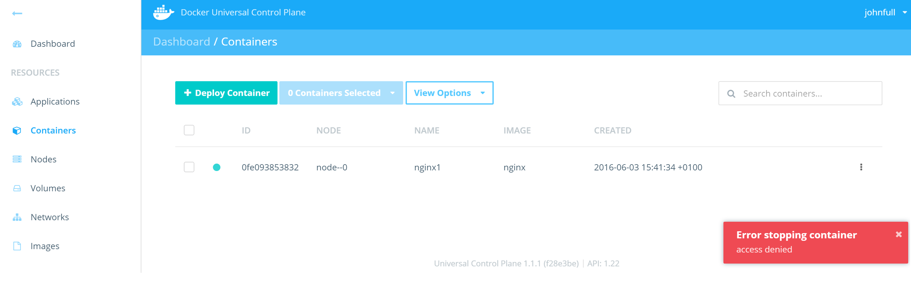
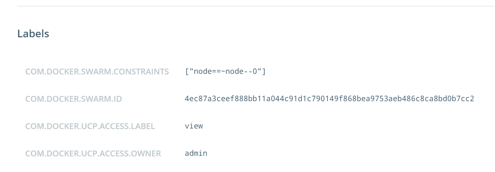
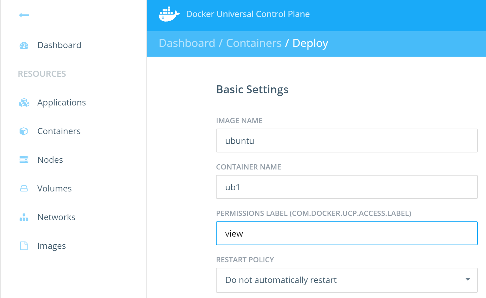
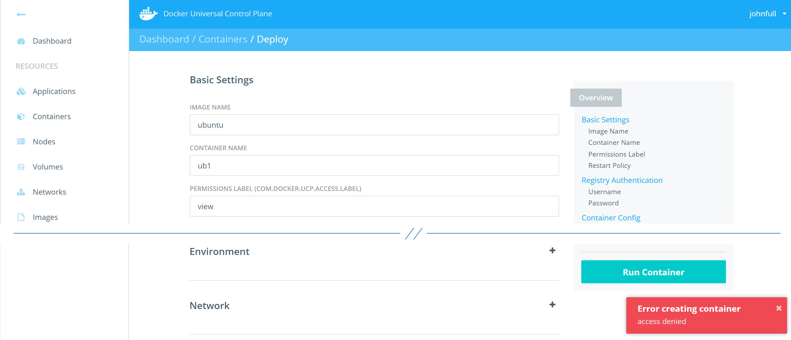
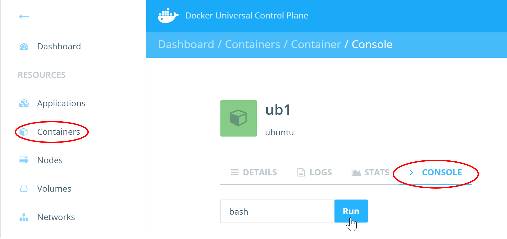
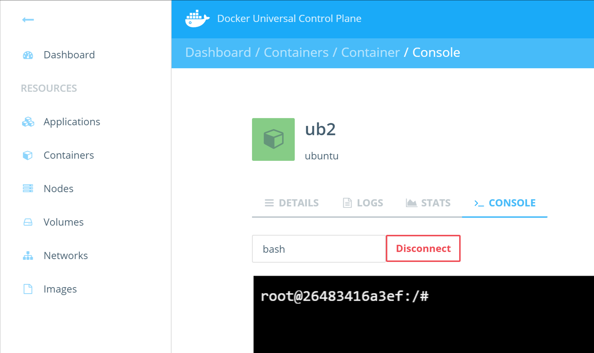
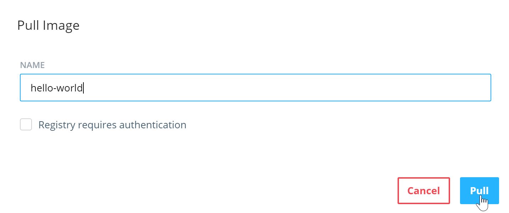

<!--
# Task 2 - Test User Access
//-->
# タスク 2 - ユーザアクセスのテスト

<!--
In this task you will complete the following steps:
//-->
このタスクでは次の手順を行います。

<!--
1. Test permission labels
2. Test container access from the web UI
3. Test container access from the command line
4. Test admin access form the command line
5. Test default permissions
//-->

1. パーミッションラベルのテスト
2. web UI からのコンテナアクセスのテスト
3. コマンドラインからのコンテナアクセスのテスト
4. コマンドラインからの管理者アクセスのテスト
5. デフォルトパーミッションのテスト

<!--
## Pre-requisites
//-->
## 前提条件

<!--
- Completed Task 1
//-->

- タスク 1を完了していること

<!--
## Step 1 - Test permission labels
//-->
## 手順 1 - パーミッションラベルのテスト

<!--
Docker UCP uses labels to implement permissions and access control. In the previous lab (Task 1) you deployed the "nginx1" container with the "view" label. You also assigned the Engineering team "View Only" access to all resources tagged with the "view" label. In this step you will log back in to UCP as "johnfull" and verify that you only have view access to the "nginx1" container.
//-->
Docker UCP はパーミッションとアクセスコントロールを実装するために、ラベルを使います。先の実習(タスク 1)では、「view」ラベルをつけた「nginx1」コンテナをデプロイしました。また、「view」ラベルをタグづけしたすべてのリソースに対して、Engineering チームの「View Only」アクセスを割り当てました。この手順では、UCP に「johnfull」 としてログインし直し、「nginx1」コンテナに対して閲覧アクセスのみが許可されていることを検証します。

<!--
1. Logout of UCP and log back in as user **johnfull**
//-->
1. UCP からログアウトし、 **johnfull** ユーザでログインし直します。

<!--
2. Click on the **Containers** link in the left pane.
//-->
2. 左ペインの **Containers** をクリックします。

<!--
  Confirm that you can only see the "nginx1" container (with the "view" label). The other containers that you deployed with no labels will not be visible.
//-->
  (「view」ラベルつきの)「nginx1」コンテナのみが見えることを確認します。ラベルなしでデプロイした他のコンテナは見えないはずです。

<!--
3. Click the controls button to the right of the container (three dots) and attempt to **Stop** the container. The action will fail and you will see an error message like the one shown below.
//-->
3. コンテナの右にあるコントロールボタン(3つのドット)をクリックし、コンテナを **Stop** します。失敗して次のようなエラーメッセージが表示されるはずです。

<!--
  
//-->
  

<!--
4. Click on the container to view its details.
//-->
4. コンテナをクリックして詳細を閲覧します。

<!--
5. Scroll down to the **Labels** section and verify the presence of the **view** label.
//-->
5. **Labels** セクションまでスクロールダウンし、 **view** ラベルの存在を確認します。

<!--
  
//-->
  

<!--
6. Click the **Containers** link in the left pane.
//-->
6. 左ペインの **Containers** をクリックします。

<!--
7. Click the **+ Deploy Container** button to deploy a new container with the following basic options.
//-->
7. **+ Deploy Container** ボタンをクリックし、次の基本オプションで新しいコンテナをデプロイします。

<!--
  
//-->
  

<!--
  When you click the **Run Container** button, the deployment will fail. This is because members of the Engineering team only have *View Only* access to resources with the **view** label. They cannot create containers with the **view** label.
//-->
**Run Container** ボタンをクリックすると、デプロイに失敗するはずです。なぜなら、Engineering チームのメンバーは **view** ラベルのついたリソースに対しての *View Only* アクセスしか持っていないからです。 **view** ラベルのついたコンテナの作成はできません。

<!--
  
//-->
  

<!--
8. Repeat the previous action two more times, but configure the containers as shown in the table below:
//-->
8. 先の手順を 2回以上繰り返します。ただし次の表のようにコンテナが設定されています。

| Image Name | Container Name  | Permissions Label |
| :--------- | :---------------| :---------------- |
| ubuntu     | ub1             | restricted        |
| ubuntu     | ub2             | run               |

<!--
  Deploying with either of these two labels will work. This is because members of the Engineering team have *Restricted Control* on the **restricted** label, and *Full Control* on the **run** label. Both of these permissions allow for the deployment of new containers.
//-->
  これら 2つのラベルのどちらかをつけてデプロイしたものは動作するはずです。なぜなら、Engineering チームのメンバーは **restricted** ラベルに対して *Restricted Control* を持っているからです。これらのパーミッションはどちらも新しいコンテナのデプロイを許可します。


<!--
## Step 2 - Test container access from the web UI
//-->
## 手順 2 - web UI からのコンテナアクセスのテスト

<!--
In this step you will attempt to perform certain actions while logged in as the **johnfull** user. Depending on which permissions labels are in force will determine whether these actions succeed or fail.
//-->
この手順では **johnfull** ユーザでログインし、特定の動作を実行してみます。どのパーミッションが割り当てられているかによって、その動作が成功するか実行するかが決まります。

<!--
1. Click on the container **ub1**. Then click the **Console** tab.
//-->
1. コンテナ **ub1** をクリックし、 **Console** タブをクリックします。

<!--
  
//-->
  

<!--
2. Click on the **Run** button with "bash" specified in the field.
//-->
2. フォームに「bash」と入力して **Run** ボタンをクリックします。

<!--
  This action is the GUI equivalent of running a `docker exec` command. In this case, you are trying to execute a `bash` terminal inside the **ub1** container.
//-->
  これは `docker exec` コマンドを実行するのと同じことを GUI で行っています。ここでは **ub1** コンテナ内で `bash` ターミナルを実行しようとしています。

<!--
  You will get an error message saying *Error attempting to open exec session*. This is because the you are logged in as **johnfull** who is a member of the **Engineering** team, and the **Engineering** team only have *Restricted Control* to the **ub1** container via the **restricted** label. *Restricted Control* does not allow you to open exec sessions to a container.
//-->
  *Error attempting to open exec session* というエラーメッセージが出てしまったはずです。なぜなら **Engineering** チームのメンバーである **johnfull** でログインしているからです。 **Engineering** チームは **ub1** コンテナに対して **restricted** ラベルを通して *Restricted Control* しか持っていないのです。 *Restricted Control* はコンテナに対して exec セッションを開くことを許可していません。

<!--
4. Now try the same thing with the **ub2** container.
//-->
4. では **ub2** コンテナに対して同じことを試してみましょう。

<!--
   This time the bash terminal will launch successfully. This is because the user **johnfull** is a member of the **Engineering** team which has *Full Control* over the **ub2** container via the **run** label.
//-->
   今度は bash ターミナルの起動に成功したはずです。なぜなら **johnfull** は、 **ub2** コンテナに対して **run** ラベルを通して *Full Control* を持っている **Engineering** チームのメンバーだからです。

<!--
  
//-->
  

<!--
## Step 3 - Test container access from the command line
//-->
## 手順 3 - コマンドラインからのコンテナアクセスのテスト

<!--
In this step you will create and download a **client bundle** for the **johnfull** user, connect to UCP using the client bundle, and perform some tests from the command line. You can do this from either a Windows or Mac. The steps below are from a Windows machine.
//-->
この手順では、 **johnfull** ユーザの **client bundle** を作成してダウンロードし、client bundle を使って UCP に接続し、コマンドラインからいくつかテストを実行します。この手順は Windows でも Mac でも実行できます。ここでは Windows マシンで行っています。

<!--
1. Click the **johnfull** dropdown in the top right corner and select **Profile**.
//-->
1. 右上の **johnfull** ドロップダウンをクリックし、 **Profile** を選択します。

<!--
2. Scroll to the bottom of the profile screen and click **Create a Client Bundle**.
//-->
2. プロファイルスクリーンの一番下までスクロールし、 **Create a Client Bundle** をクリックします。

<!--
  This will download the client bundle to your local machine as a zipped archive file.
//-->
  zip アーカイブファイルの client bundle をダウンロードするはずです。

<!--
3. Unzip the contents of the archive file and open a command prompt to the location of the extracted contents. On a Windows machine this is likely to be C:\Users\your-user\Downloads\ucp-bundle-johnfull.
//-->
3. このアーカイブファイルをワークステーションに scp して unzip し、展開したディレクトリでコマンドプロンプトを開きます。Windows マシンでは C:\Users\your-user\Downloads\ucp-bundle-johnfull のような形になるはずです。

<!--
  The examples in this tutorial are using Git Bash. Feel free to use a command line tool of your choice.
//-->
  このチュートリアルの例では Git Bash を使っています。お好みのコマンドラインツールをお使いいただいてかまいません。

<!--
4. List the files in your current directory.
//-->
4. カレントディレクトリのファイルを一覧表示します。

   ```
   nigel@surfacewah MINGW64 ~/Downloads/ucp-bundle-johnfull
   $ ls
   ca.pem  cert.pem  cert.pub  env.cmd  env.ps1  env.sh  key.pem
   ```

<!--
5. Execute the `env.sh` shell script.
//-->
5. `env.sh` シェルスクリプトを実行します。

  ```
  nigel@surfacewah MINGW64 ~/Downloads/ucp-bundle-johnfull
  $ source env.sh
  ```

<!--
6. Run a `docker ps` command to list the containers.
//-->
6. `docker ps` コマンドを実行してコンテナを一覧表示します。

<!--
  The output should contain the "nginx1", "ub1", and "ub2" containers created in the previous steps.
//-->
  出力には、先の手順で作成した「nginx1」「ub1」「ub2」コンテナが含まれているはずです。

  ```
  nigel@surfacewah MINGW64 ~/Downloads/ucp-bundle-johnful
  $ docker ps
  CONTAINER ID   IMAGE      COMMAND                  CREATED             STATUS              PORTS             NAMES
  26483416a3ef   ubuntu     "/bin/bash"              About an hour ago   Up About an hour                      ub2
  656e3e4c0ccf   ubuntu     "/bin/bash"              About an hour ago   Up About an hour                      ub1
  0fe093853832   nginx      "nginx -g 'daemon off"   About an hour ago   Up About an hour    80/tcp, 443/tcp   nginx1
  ```

<!--
7. Run `docker exec -it ub1 bash` to open a `bash` terminal on the "ub2" container.
//-->
7. 「ub1」コンテナに対して `docker exec -it ub1 bash` を実行して `bash` ターミナルを開きます。

<!--
   This will result in an *Error response from daemon: access denied* error. This is because the "ub1" container is tagged with the "restricted" label, which maps the *Restricted Control* permission to members of the Engineering team.
//-->
   *Error response from daemon: access denied* というエラーになったはずです。なぜなら「ub1」コンテナは「restricted」ラベルがつけられているからです。「restricted」ラベルは Engineering チームのメンバーに対して *Restricted Control* パーミッションを与えています。

<!--
8. Repeat the same command for the **ub2** container.
//-->
8. **ub2** コンテナに対して同じようにコマンドを実行します。

<!--
   This time the command works because the **ub2** container is tagged with the **run** label which maps the *Full Control* permission to members of the Engineering team. Restricted Control does not allow users to `docker exec` into a container.
//-->
   今度はコマンドが成功しました。なぜなら **ub2** コンテナは **run** ラベルがつけられているからです。 **run** ラベルは Engineering チームのメンバーに対して *Full Control* パーミッションを与えています。Restricted Control はコンテナに `docker exec` を許可していません。


<!--
## Step 4 - Test admin access form the command line
//-->
## 手順 4 - コマンドラインからの管理者アクセスのテスト

<!--
In this step you will attempt to launch a console form the UCP web UI, as well as the **admin** user's client bundle.
//-->
この手順では、UCP web UI からコンソールの起動を試み、 **admin** ユーザの client bundle でも同様のことを行います。

<!--
1. Logout of UCP as **johnfull** and log back in as the **admin** user
//-->
1. UCP から **johnfull** ユーザをログアウトし、 **admin** ユーザでログインし直します。

<!--
2. Click the **Containers** link in the left of the web UI and click the **ub1** container.
//-->
2. web UI の左にある **Containers** をクリックし、 **ub1** コンテナをクリックします。

<!--
3. Click the **Console** tab and then click the **Run** button to run a `bash` terminal.
//-->
3. **Console** タブをクリックし、 **Run** ボタンをクリックして `bash` ターミナルを起動します。

<!--
   This time the terminal opens. This is because the "admin" user has full access to all UCP resources, regardless of permissions labels that are applied.
//-->
   今回はターミナルが開きます。なぜなら「admin」ユーザはすべての UCP リソースに対して、パーミッションラベルの適用に関わらず、フルアクセスできるからです。

<!--
4. Download the Admin user's client bundle and unzip to a folder of your choice.  See steps 3.1-3.3 for details of how to do this.
//-->
4. Admin ユーザの client bundle をダウンロードし、お好きなところに unzip します。どのようにするかは手順 3.1 〜 3.3 を見てください。

<!--
5. Open a command prompt to the location of the unzipped client bundle and execute the `env.sh` script.
//-->
5. client bundle を unzip したところでコマンドプロンプトを開き、 `env.sh` スクリプトを実行します。

<!--
6. Run a `docker ps` command and take note of how many containers you can see.
//-->
6. `docker ps` コマンドを実行し、どれだけコンテナが表示されたか確認します。

<!--
   You should see the **nginx1**, **ub1** and **ub2** containers that were launched in Step 1. You should also see any additional containers that you launched without permissions labels at the end of Task 1.
//-->
   手順 1 で起動した **nginx1** 、 **ub1** 、 **ub2** コンテナが表示されたはずです。さらに、タスク 1 の最後でパーミッションラベルなしで起動したコンテナも表示されたはずです。

<!--
7. Run `docker exec` and open a `bash` terminal to the "ub1" container
//-->
7. `docker exec` を実行し、「ub1」コンテナで `bash` ターミナルを開きます。

<!--
   The operation will also succeed because you are connected to UCP as the **admin** user.
//-->
   この処理は成功します。なぜなら、UCP に **admin** ユーザで接続しているからです。

<!--
## Step 5 - Test default permissions
//-->
## 手順 5 - デフォルトパーミッションのテスト

<!--
In this step you will test access to UCP resources that are not tagged with permissions labels. The actions in this step wil be performed in the Docker UCP web UI.
//-->
この手順では、パーミッションラベルをつけられていない UCP リソースへのアクセステストを行います。この手順での処理は Docker UCP web UI で行います。

<!--
1. Logout of UCP as the **admin** user and log back in as **johnfull**.
//-->
1. UCP から **admin** ユーザをログアウトし、 **johnfull** でログインし直します。

<!--
2. Click on the **Images** link and click **Pull Image**.
//-->
2. **Images** をクリックし、 **Pull Image** をクリックします。

<!--
3. Pull the "hello-world" image.
//-->
3. 「hello-world」イメージを pull します。

<!--
  
//-->
  

<!--
  The image pull operation will be successful.
//-->
  イメージ pull 処理は成功するはずです。

<!--
4. Click on the **Networks** link and click **+ Create Network** to create a new network called "johns-net".
//-->
4. **Networks** をクリックし、 **+ Create Network** をクリックして「johns-net」という新しいネットワークを作成します。

<!--
  Just give the network a name and click **Create**.
//-->
  ネットワークに名前をつけて **Create** をクリックします。

<!--
  The network will be successfully created.
//-->
  ネットワークの作成は成功するはずです。

<!--
From the previous 4 steps we can see that the user **johnfull** has full access to create networks, pull images, and perform other UCP tasks. This is because **johnfull** has the *Full Access* default permission, giving him full access to all non-tagged UCP resources. His access is only restricted to resources tagged with permissions labels.
//-->
先の 4つの手順から、 **johnfull** ユーザはネットワークの作成、イメージの pull など、UCP タスクの実行にフルアクセスがあることがわかります。なぜなら **johnfull** は、ラベルづけのない UCP リソースに対してフルアクセスを提供する *Full Access* デフォルトパーミッションを持っているからです。彼のアクセスはパーミッションラベルのついているリソースに対してのみ制限されます。

<!--
5. Logout of UCP as **johnfull** and log back in as **kerryres**.
//-->
5. UCP から **johnfull** をログアウトし、 **kerryres** でログインし直します。

<!--
6. Click on the **Images** link and pull the "alpine" image.
//-->
6. **Images** をクリックし、「alpine」イメージを pull します。

<!--
7. Click on the **Networks** link and create a network called "kerry-net".
//-->
7. **Networks** をクリックし、「kerry-net」というネットワークを作成します。

<!--
  Similar  to **johnfull**, **kerryres** can also pull images and create networks despite only having the **Restricted Control** default permission. However, there are actions that users with Full Control can do, that users with Restricted Control cannot do such as `docker exec` into containers and lauch **privileged** containers.
//-->
  **johnfull** のように、デフォルトパーミッションの **Restricted Control** だけを持っているにも関わらず、イメージの pull とネットワークの作成が行えます。しかし、Full Control を持つユーザが行える動作があり、Restricted Control を持つユーザはコンテナに `docker exec` や **privileged** コンテナの起動のようなことは行えません。

<!--
8. Logout of UCP as **kerryres** and log back in as **barryview**.
//-->
8. UCP から **kerryres** をログアウトし、 **barryview** でログインし直します。

<!--
9. Click on the **Images** link.
//-->
9. **Images** をクリックします。

<!--
  Notice that Barry does not even have a **Pull Image** button. This is because **barryview** has the **View Only** default permission. This permission does not allow operations such as pulling images.
//-->
  Barry は **Pull Image** ボタンがないことに注意してください。なぜなら **barryview** は **View Only** のデフォルトパーミッションを持っているからです。このパーミッションはイメージの pull のような処理を許可していません。

<!--
10. Click the **Networks** link and create a network called "barry-net".
//-->
10. **Networks** をクリックし、「barry-net」というネットワークを作成します。

<!--
   You will get an **Error creating network: access denied** error message because of insufficient permissions.
//-->
   **Error creating network: access denied** というエラーメッセージが出たはずです。なぜならパーミッションが不十分だからです。

<!--
11. Logout of UCP as **barryview** and login as **traceyno**.
//-->
11. UCP から **barryview** をログアウトし、 **traceyno** でログインします。

<!--
12. Notice that Tracey only has links to the following three resource types:
//-->
12. Tracey は次の 3つのリソースタイプのみを持っていることに注意してください。
   - Applications
   - Containers
   - Nodes

<!--
    This is because Tracey has the **No Access** default permission. However, because Tracey is a members of the Engineering team, she gets access to all of the tagged resources that the Engineering team has access to.
//-->
    なぜなら Tracey は **No Access** デフォルトパーミッションを持っているからです。しかし、Tracey は Engineering チームのメンバーなので、彼女は Engineering チームがアクセスできるラベルつきリソースのすべてにアクセスできます。

<!--
13. Click the **Containers** link and notice that Tracey can see the three containers that have the **view** label attached to them.
//-->
13. **Containers** をクリックし、Tracey は **view** ラベルを持つ 3つのコンテナが見えていることを確認してください。
  
  


   
